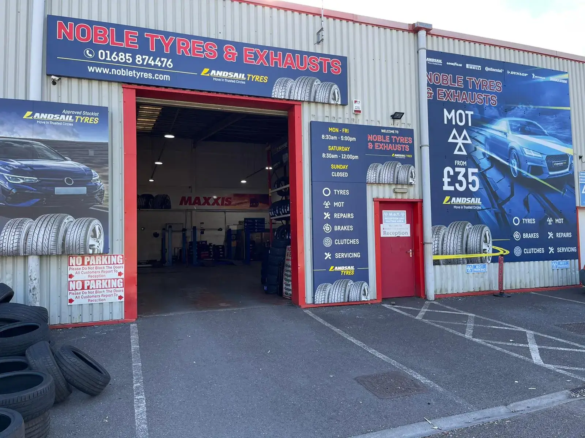
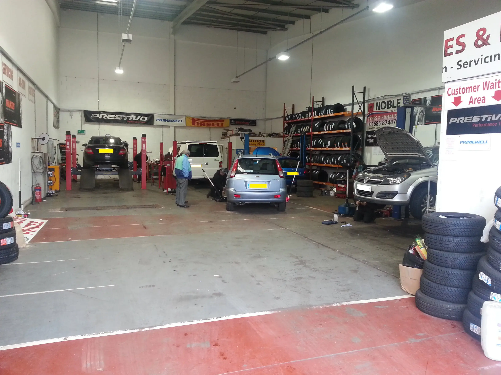

# nobletyres.com

[Noble Tyres & Exhausts LTD](https://nobletyres.com/)
===============================

NOBLE TYRES & EXHAUSTS. 1ST CHOICE CAR GARAGE FOR TYRES, EXHAUSTS, BRAKES, MOT AND SERVICING IN ABERDARE

*   [Home](https://nobletyres.com/)
*   [Services](https://nobletyres.com/#services)
*   [About](https://nobletyres.com/#about)
*   [Products](https://nobletyres.com/#products)
*   [Contact](https://nobletyres.com/#contact)

Noble Tyre's & exhausts | 1st choice for tyres | 1st choice for exhausts | 1st choice for Brakes | 1st choice for MOT | 1st choice for Servicing | 1st choice for Mobile Tyre Fitting | no.1 garage in aberdare
---------------------------------------------------------------------------------------------------------------------------------------------------------------------------------------------------------------

We are a friendly, family-run Garage that service the local area and the surroundings of Aberdare. We offer a range of Quality Tyres, servicing, brakes, repairs and MOT’s and to ensure that the customers we offer a great service.

[Contact Us](https://nobletyres.com/#contact)

##### What Noble Tyre's Offer

Our Services
------------

#### Our Tyre's

We offer a fantastic Range of Tyre's from Budget to High . Give us a Call on [01685 874476](tel:01685 874476) to see what we have in stock.

#### MOT From £35

We offer a fantastic MOT service from £35. Give us a Call on [01685 874476](tel:01685 874476)

#### Contact Us

If you want to book an MOT, servicing or any issues with your vehicle at our Garage in Aberdare, please call us on [01685 874476](tel:01685 874476)

##### Noble tyres history

About Us
--------

Situated in Aberaman, Aberdare Noble Tyre’s Garage is run by the owner Andrew and his brother Michael and father Les. Noble Tyre’s has been providing a quality service to our customers over the past few years that offer great service great prices and quality workmanship. We are all IMI motor members with ATA approved technicians working on your vehicles.

### Our Garage

### Inside Our Garage

##### Wide range of products on offer

Our Products
------------

#### Tracking

We use supertracker for wheel alignment and if you have uneven wear on your tyres or any components been changed on your steering or suspension then tracking is needed.

#### TPMS

A tire-pressure monitoring system (TPMS) is an electronic system designed to monitor the air pressure inside the pneumatic tires on various types of vehicles.

#### Clutch

Sticking or binding in the pedal linkage, cable, cross shaft, or pivot ball are common causes of clutch failure. Sometimes a blockage or worn seals in the hydraulic system can …

#### Diagnostic

We can perform various car diagnostic on issues such as engine light on, service recalls, abs faults and much more

#### Servicing & Repairs

We offer a range of servicing from basic to major service as regular maintenance is necessary. We can service you’re vehicle’s under manufacturing warranties. Servicing usually occurs around 10,000 miles …

#### Brakes

If the lining is down to the thickness of the steel backing plate, the pads should be replaced. To check disc brakes, follow these steps: Jack up your vehicle and …

##### Call us for any questions on your vehicle

Get in touch
------------

#### If you want to book and MOT, servicing or any issues with your vehicle at our Garage in Aberdare, please call us on [01685 874476](tel:01685 874476)

### Noble Tyres & Exhaust LTD

Unit 3 C1 Trade Park
Aberaman
Aberdare
Rhondda Cynon Taff
CF44 6DA

[01685 874476](tel:01685 874476)

##### Check us out on Facebook, Twitter and Google+

Copyright © 2024 Noble Tyres & Exhausts LTD
